```mermaid
graph TB
    subgraph "Client Layer"
        USER[👤 End Users]
        API_CLIENT[🔌 API Clients]
        WEBAPP[🌐 Web Application]
    end

    subgraph "API Gateway & Security"
        NGINX[🔒 Nginx Reverse Proxy<br/>SSL TLS Termination]
        AUTH[🔑 Authentication Layer<br/>API Keys JWT]
        RATE_LIMIT[⏱️ Rate Limiter<br/>60 requests per minute]
    end

    subgraph "Flask API Layer - src/api/"
        ROUTES[📋 Flask Routes<br/>health ingest query sessions]
        VALIDATION[✅ Pydantic Validation<br/>Request Response Schemas]
        SESSION_MGR[💬 Session Manager<br/>Conversation History]
    end

    subgraph "Ingestion Pipeline - src/ingestion/"
        LOADER[📄 Document Loaders<br/>PDF DOCX TXT HTML URL]
        CHUNKER[✂️ Adaptive Chunker<br/>400-1200 tokens<br/>RecursiveCharacterTextSplitter]
        METADATA[🏷️ Metadata Enrichment<br/>Source Type Timestamp]
    end

    subgraph "Embedding Service - src/embeddings/"
        EMB_ROUTER[🔀 Provider Router]
        OPENAI_EMB[🤖 OpenAI Embeddings<br/>text-embedding-3-large<br/>3072 dims to 1536]
        SENT_TRANS[🧠 Sentence Transformers<br/>all-mpnet-base-v2<br/>768 dims]
        BATCH_PROC[📦 Batch Processor<br/>100 docs per batch<br/>Retry Logic]
    end

    subgraph "Vector Store - Elasticsearch"
        ES_INDEX[📊 Vector Index<br/>rag_documents<br/>1536-dim embeddings]
        ES_KNN[🔍 kNN Search<br/>Cosine Similarity]
        ES_FILTER[🎯 Metadata Filtering<br/>department type date]
    end

    subgraph "Retrieval Layer - src/retrieval/"
        RETRIEVER[🔎 LangChain Retriever<br/>ElasticsearchStore]
        RERANK[📊 Re-ranker Optional<br/>MMR Cross-Encoder]
        CONTEXT_BUILD[📝 Context Builder<br/>Top-K Documents]
    end

    subgraph "LLM Orchestration - src/llm/"
        LLM_ROUTER[🔀 LLM Provider Router]
        OPENAI_LLM[🤖 OpenAI GPT-4o<br/>gpt-4o-2024-08-06]
        CLAUDE_LLM[🧠 Anthropic Claude<br/>claude-3-5-sonnet-20241022]
        PROMPT_TMPL[📋 Prompt Template<br/>System Context Query]
        MEMORY[💾 Conversation Memory<br/>ConversationBufferMemory]
    end

    subgraph "Agent Layer - src/agent/"
        AGENT[🤖 LangChain Agent<br/>ReAct Pattern]
        TOOLS[🛠️ Agent Tools<br/>Calculator Web Search<br/>Workflow Triggers]
        REASONING[🧩 Multi-Step Reasoning<br/>Planning Execution]
    end

    subgraph "Response Assembly"
        CITATION[📎 Citation Generator<br/>Source Attribution]
        FORMAT[📄 Response Formatter<br/>JSON Structure]
    end

    subgraph "Observability - src/observability/"
        METRICS[📊 Prometheus Metrics<br/>Latency Throughput Errors<br/>Token Usage Cost Tracking]
        LOGGING[📝 Structured Logs<br/>Loguru JSON Format<br/>Rotation 100MB 30 days]
        TRACING[🔍 Distributed Tracing<br/>OpenTelemetry Optional]
    end

    subgraph "Monitoring Stack"
        PROMETHEUS[📈 Prometheus<br/>Time-Series DB<br/>Port 9090]
        GRAFANA[📊 Grafana Dashboards<br/>8 Visualization Panels<br/>Port 3000]
        NODE_EXP[💻 Node Exporter<br/>System Metrics<br/>Port 9100]
    end

    subgraph "Data Storage"
        ES_DATA[(💾 Elasticsearch Data<br/>Vector Embeddings<br/>Document Chunks)]
        SESSION_STORE[(💬 Session Store<br/>In-Memory<br/>Redis Optional)]
        LOG_FILES[(📁 Log Files<br/>logs app.log<br/>Auto-Rotation)]
    end

    %% Client to API Gateway
    USER --> NGINX
    API_CLIENT --> NGINX
    WEBAPP --> NGINX

    %% API Gateway to Flask
    NGINX --> AUTH
    AUTH --> RATE_LIMIT
    RATE_LIMIT --> ROUTES

    %% Flask Routes to Validation
    ROUTES --> VALIDATION
    VALIDATION --> SESSION_MGR

    %% Ingestion Flow
    ROUTES -->|POST ingest| LOADER
    LOADER --> CHUNKER
    CHUNKER --> METADATA
    METADATA --> EMB_ROUTER

    %% Embedding Flow
    EMB_ROUTER --> OPENAI_EMB
    EMB_ROUTER --> SENT_TRANS
    OPENAI_EMB --> BATCH_PROC
    SENT_TRANS --> BATCH_PROC
    BATCH_PROC --> ES_INDEX

    %% Vector Store
    ES_INDEX --> ES_DATA
    ES_INDEX --> ES_KNN
    ES_KNN --> ES_FILTER

    %% Query Flow
    ROUTES -->|POST query| RETRIEVER
    SESSION_MGR --> RETRIEVER
    ES_FILTER --> RETRIEVER
    RETRIEVER --> RERANK
    RERANK --> CONTEXT_BUILD

    %% LLM Flow
    CONTEXT_BUILD --> LLM_ROUTER
    SESSION_MGR --> MEMORY
    MEMORY --> PROMPT_TMPL
    PROMPT_TMPL --> LLM_ROUTER
    LLM_ROUTER --> OPENAI_LLM
    LLM_ROUTER --> CLAUDE_LLM

    %% Agent Flow
    OPENAI_LLM --> AGENT
    CLAUDE_LLM --> AGENT
    AGENT --> TOOLS
    AGENT --> REASONING
    REASONING --> CITATION

    %% Response Flow
    CITATION --> FORMAT
    FORMAT --> ROUTES

    %% Session Management
    SESSION_MGR --> SESSION_STORE

    %% Observability Flow
    ROUTES --> METRICS
    LOADER --> METRICS
    EMB_ROUTER --> METRICS
    LLM_ROUTER --> METRICS
    AGENT --> METRICS
    
    ROUTES --> LOGGING
    LOADER --> LOGGING
    LLM_ROUTER --> LOGGING
    LOGGING --> LOG_FILES

    METRICS --> TRACING
    TRACING --> PROMETHEUS

    %% Monitoring
    PROMETHEUS --> GRAFANA
    NODE_EXP --> PROMETHEUS
    METRICS --> PROMETHEUS

    %% Styling
    classDef client fill:#e1f5ff,stroke:#01579b,stroke-width:2px
    classDef security fill:#fff3e0,stroke:#e65100,stroke-width:2px
    classDef api fill:#f3e5f5,stroke:#4a148c,stroke-width:2px
    classDef ingestion fill:#e8f5e9,stroke:#1b5e20,stroke-width:2px
    classDef embedding fill:#fff9c4,stroke:#f57f17,stroke-width:2px
    classDef vector fill:#e0f2f1,stroke:#004d40,stroke-width:2px
    classDef llm fill:#fce4ec,stroke:#880e4f,stroke-width:2px
    classDef observability fill:#ede7f6,stroke:#311b92,stroke-width:2px
    classDef storage fill:#efebe9,stroke:#3e2723,stroke-width:2px

    class USER,API_CLIENT,WEBAPP client
    class NGINX,AUTH,RATE_LIMIT security
    class ROUTES,VALIDATION,SESSION_MGR api
    class LOADER,CHUNKER,METADATA ingestion
    class EMB_ROUTER,OPENAI_EMB,SENT_TRANS,BATCH_PROC embedding
    class ES_INDEX,ES_KNN,ES_FILTER,RETRIEVER,RERANK,CONTEXT_BUILD vector
    class LLM_ROUTER,OPENAI_LLM,CLAUDE_LLM,PROMPT_TMPL,MEMORY,AGENT,TOOLS,REASONING,CITATION,FORMAT llm
    class METRICS,LOGGING,TRACING,PROMETHEUS,GRAFANA,NODE_EXP observability
    class ES_DATA,SESSION_STORE,LOG_FILES storage
```

# Architecture Overview

The RAG Automation Agent is composed of modular services that orchestrate document ingestion, semantic indexing, and LLM-powered reasoning. The platform is designed for production-grade reliability, observability, and security.

## System Context

## Logical Components

- **Ingestion Service (`src/ingestion/`)**
  - Uses LangChain loaders to normalize input formats (PDF, DOCX, TXT, HTML).
  - Applies `RecursiveCharacterTextSplitter` with adaptive chunk sizes (500–1,000 tokens).
  - Enriches each chunk with metadata (source URI, document type, ingestion timestamp).

- **Embedding Pipeline (`src/embeddings/`)**
  - Default: `sentence-transformers/all-mpnet-base-v2` for on-prem deployments.
  - Optional: `text-embedding-3-large` (OpenAI) or `claude-embedding-2` (Anthropic) for higher accuracy.
  - Batched processing with GPU acceleration when available.

- **Vector Store Layer (`src/vector_store/`)**
  - Elasticsearch 8.x with kNN enabled.
  - Index template with fields: `id`, `content`, `metadata`, `embedding` (dense vector), `created_at`.
  - Similarity metrics: cosine (default) with option for dot product.

- **Retrieval Layer (`src/retrieval/`)**
  - LangChain `ElasticsearchStore` retriever.
  - Supports metadata filters, max marginal relevance, and custom re-rankers.

- **LLM Orchestrator (`src/llm/`)**
  - Abstract provider interface for OpenAI, Anthropic, and self-hosted models.
  - Prompt templates with source citation injection.
  - Conversational memory via `ConversationBufferMemory` (Redis optional for persistence).

- **Agent Layer (`src/agent/`)**
  - LangChain agent with tool router for calculators, web search, and workflow triggers.
  - Multi-step reasoning with guardrails for cost and latency.

- **API Layer (`src/api/`)**
  - Flask application exposing `/query`, `/ingest`, `/health`, `/sessions` endpoints.
  - Input validation with Pydantic models.
  - Authentication via API keys or JWT.

- **Observability (`src/observability/`)**
  - Structured logging with Loguru.
  - Prometheus metrics exporter (latency, throughput, error rates).
  - Tracing hooks for OpenTelemetry (optional).

## Data Flow (Ingestion → Retrieval → Generation)

1. **Ingestion Trigger**: Users call `/ingest` with document payload or remote URI.
2. **Document Loading**: Ingestion service detects MIME type and applies the appropriate LangChain loader.
3. **Chunking & Metadata**: Text splitter produces overlapping chunks, storing metadata including source, language, tags, and access scope.
4. **Embedding Generation**: Embedding service batches chunks and requests embeddings (local or API-based models).
5. **Indexing**: Chunks are indexed into Elasticsearch with dense vectors and metadata fields.
6. **Retrieval**: `/query` endpoint triggers retriever with similarity + optional re-ranking.
7. **Generation**: LLM receives prompt with top-k context snippets and conversation history.
8. **Response Assembly**: Agent merges LLM output with citation metadata and tool results.
9. **Observability Hooks**: Metrics and logs emitted for latency, token usage, and retrieval quality.

## Model & Vector Choices

| Concern | Default | Alternatives | Notes |
|---------|---------|--------------|-------|
| Embeddings | `sentence-transformers/all-mpnet-base-v2` | `text-embedding-3-large`, `bge-large-en` | Align with data residency constraints. |
| LLM | `gpt-4o` | `claude-3-sonnet`, `llama-3-70b-instruct` | Interface via provider adapters to switch easily. |
| Vector Store | Elasticsearch 8.x | OpenSearch, Milvus | Elasticsearch selected for enterprise support and kNN maturity. |
| Similarity | Cosine | Dot product, Euclidean | Choose per embedding model characteristics. |

## Scaling & Deployment Considerations

- **Docker Compose** for local development (Flask API, Elasticsearch, Prometheus, Grafana).
- **CI/CD**: GitHub Actions running linting, pytest, safety, and Docker image builds.
- **Staging**: Reverse proxy (Nginx/Traefik), HTTPS via Let’s Encrypt, secrets in GitHub Actions or Vault.
- **Production Readiness**: Horizontal scaling via Kubernetes (optional), Elasticsearch replicas, Redis-backed caching of hot queries.

## Security & Governance

- API authentication via signed tokens.
- Role-based access for document ingestion and retrieval.
- Audit logging of user queries and retrieved documents.
- Data retention policies aligned with GDPR; configurable purge jobs.

# Architecture Overview

The RAG Automation Agent is composed of modular services that orchestrate document ingestion, semantic indexing, and LLM-powered reasoning. The platform is designed for production-grade reliability, observability, and security.

## System Context

